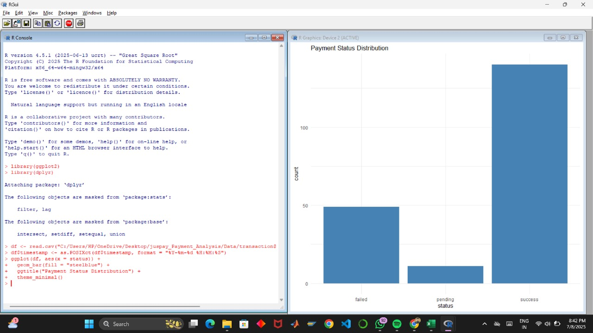
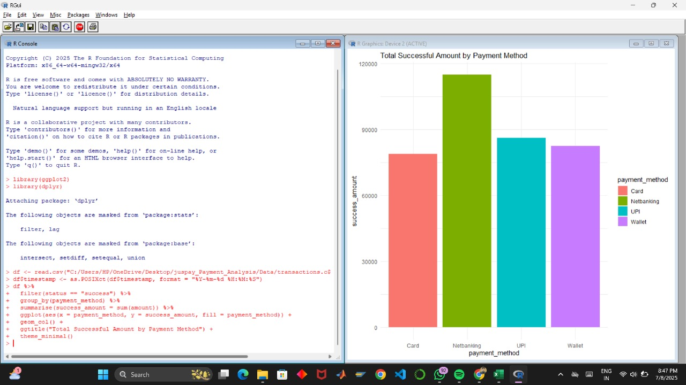
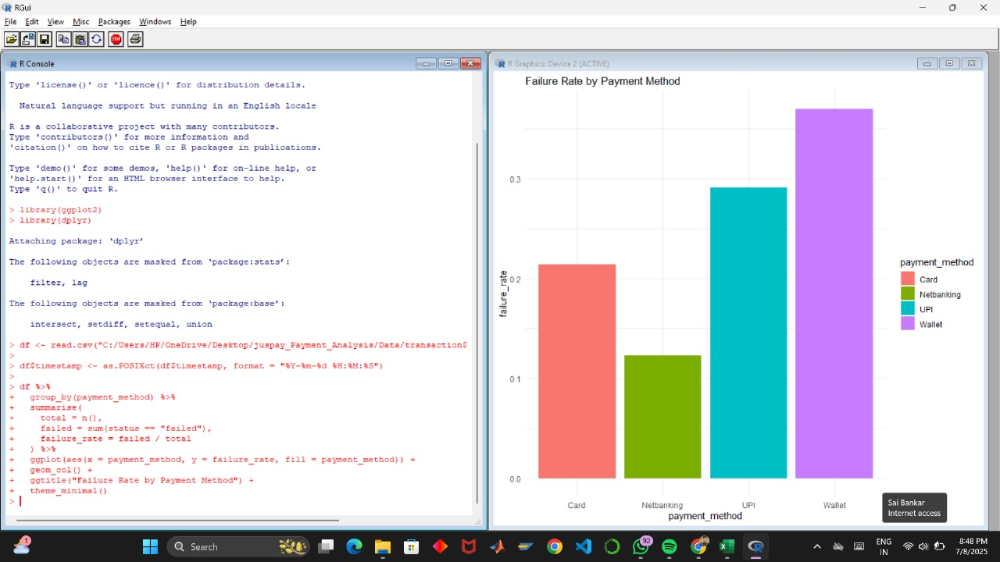
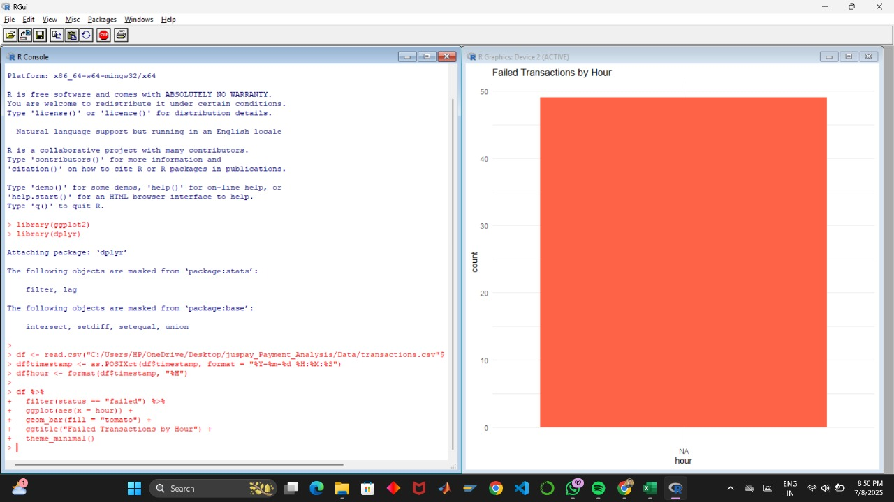

#  Payment Analysis Project

A complete end-to-end data analysis project focused on payment transactions — designed to reflect real-world business insights and product thinking. This project simulates a payment funnel analysis.
> Technologies used: **SQL**, **R**, **ggplot2**, **dplyr** and **GitHub**

## Objective

To analyze a dataset of payment transactions in order to:
- Identify the most reliable and high-performing payment methods
- Detect patterns in failed transactions
- Discover time-based spikes and trends
- Recommend actionable product improvements

## Tools & Technologies

| Tool          | Purpose                          |
|---------------|----------------------------------|
| R             | Data processing & visualization  |
| ggplot2       | Graphs and plots                 |
| dplyr         | Data manipulation                |
| SQL (DB Fiddle) | Querying & aggregating data     |
| Git & GitHub  | Version control & publishing     |

## SQL Analysis Summary

All SQL queries were performed using [DB Fiddle](https://www.db-fiddle.com/).  
The schema and insert statements are available in `queries.sql`.

| Metric                  | Value             |
|-------------------------|------------------|
| Total Transactions    | 200               |
| Total Success Amount  | ₹3,62,378.30      |
| Failed Transactions   | 49                |
| Top Payment Method    | UPI               |
| Highest Failure Rate  | Wallet            |
| Peak Failure Hours    | 3PM & 9PM         |
| Top Transaction       | ₹4,949 via Card   |

## Visualizations (via R + ggplot2)

All charts were created using R and saved as `.jpg` files in the `screenshots/` folder.

### 1. Payment Status Distribution

### 2. Successful Amount per Payment Method

### 3. Failure Rate by Payment Method

### 4. Failed Transactions by Hour

## Recommendations

Based on the analysis:
- Implement retry logic for **Wallet** payments (highest failure rate)
- Set **UPI** as default method (highest revenue contributor)
- Apply **gateway switching** or backups during peak failure hours (15:00 & 21:00)
- Monitor top customers (high-value payments) for special care

